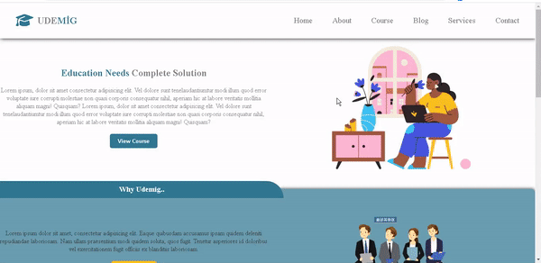

<h1> Course-Website </h1>

I've independently designed and coded a responsive course website, and it's ready to explore!

🔸 Project Name: Course Web Site

🔸 Technologies Used: HTML, CSS

🔸 Project Description: This website, which I designed and coded from scratch, works flawlessly on various devices, 

from mobile phones to desktop computers...

<h2>Screen_Shoot</h2>

